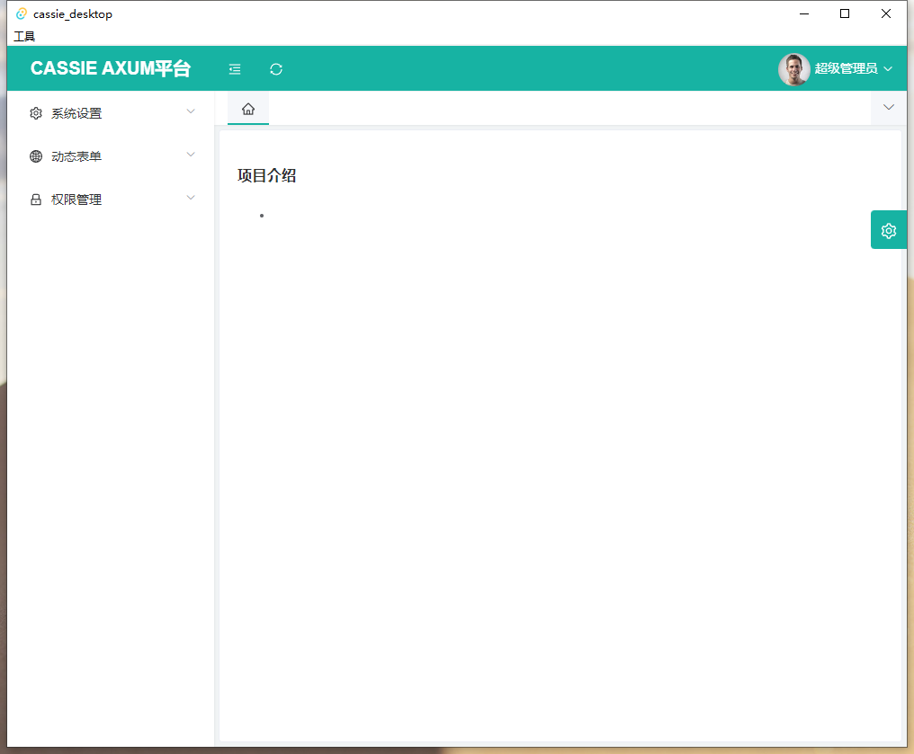
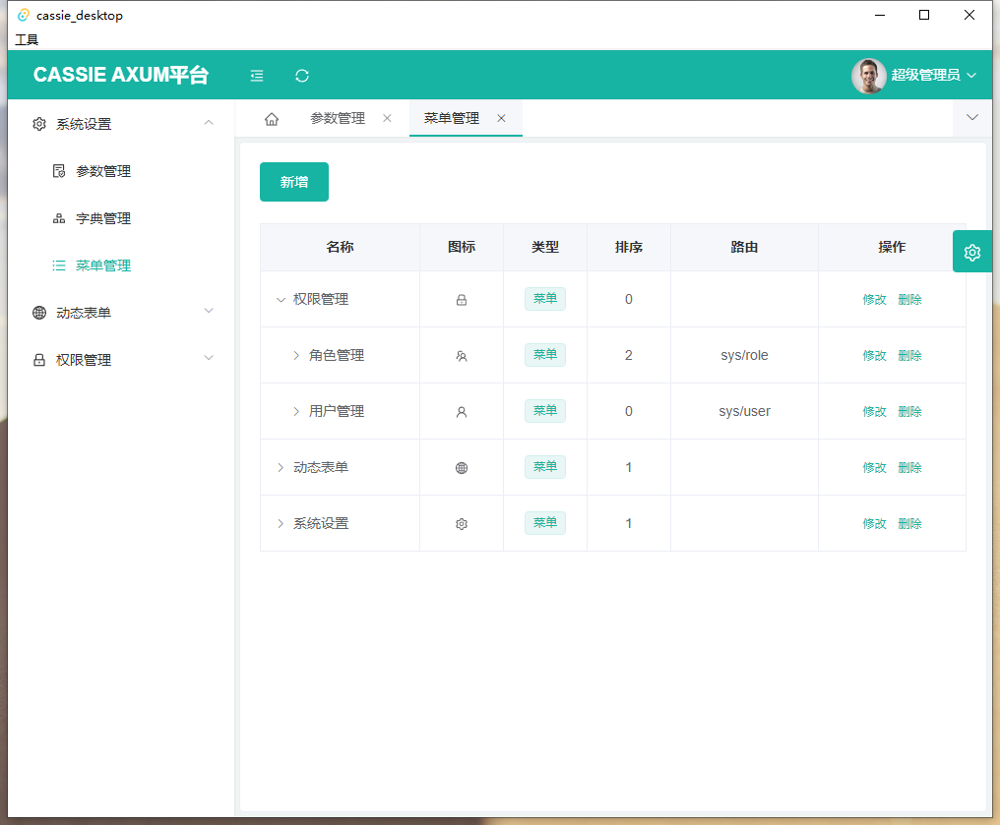
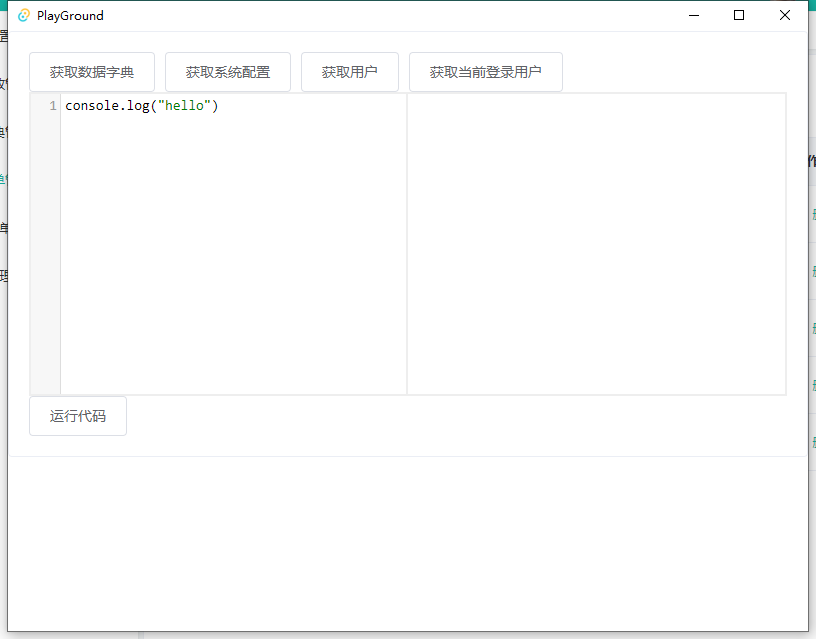

# cassie_admin

#### 介绍
基于cassie axum 前端项目
前端使用vue 桌面端兼容 tauri

#### tauri
Tauri 是一个为所有主流桌面平台构建小型、快速二进制文件的框架。开发人员可以集成任何编译成 HTML、 JS 和 CSS 的前端框架来构建他们的用户界面。应用程序的后端是一个 Rust 二进制文件，具有前端可以与之交互的 API。

#### tauri Electron对比
Electron.JS 62.5mb /  
Tauri 4.32mb

#### 软件架构

软件架构说明

1. http请求axios
2. 工具集lodash
3. ui element-ui
4. 框架 vue
5. 桌面端支持 tauri
6. 桌面存储sqlite

### 使用说明

1. 启动后端项目 cassie axum
2. npm run install 下载前端依赖文件
#### 安装rust开发环境
3. 进入 src-tauri 执行命令 cargo build

#### 框架说明
管理员账号:admin/123456
测试账号:lixingdong1/123456

#### 参与贡献

String <348040933@qq.com>
交流群:435604279

